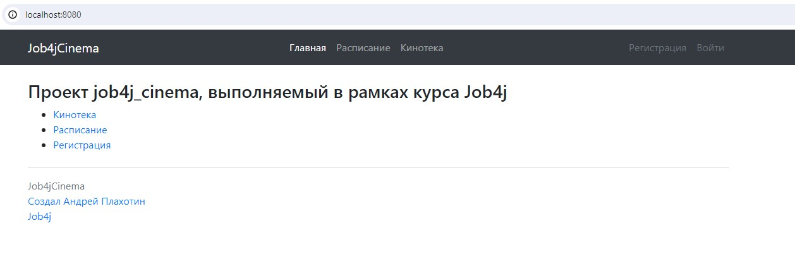
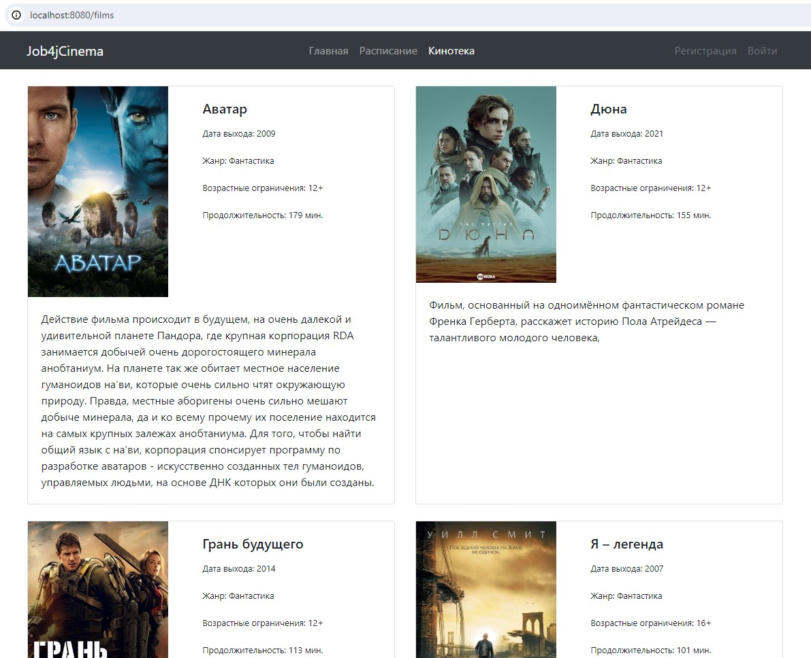
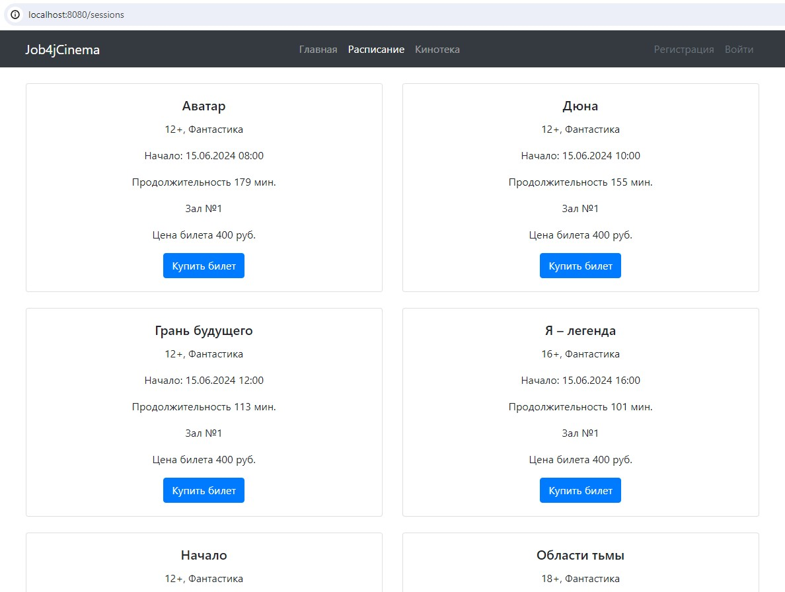
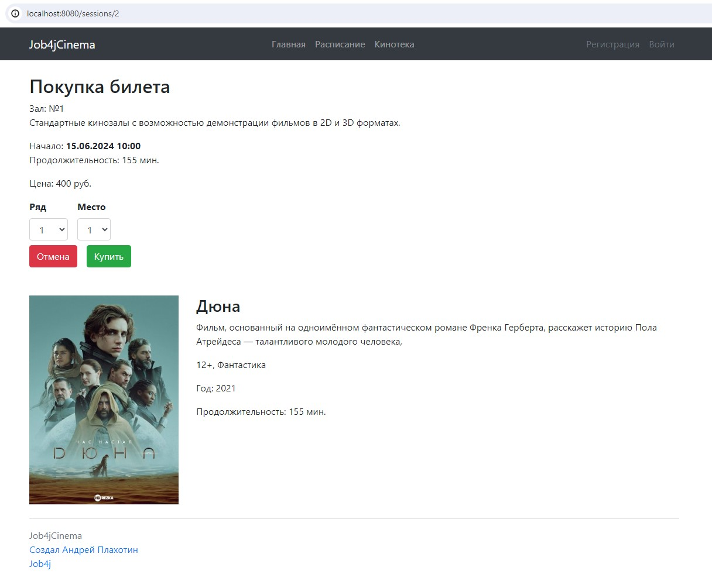
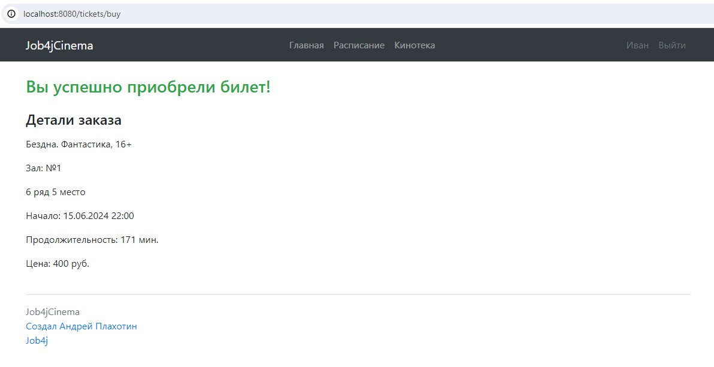
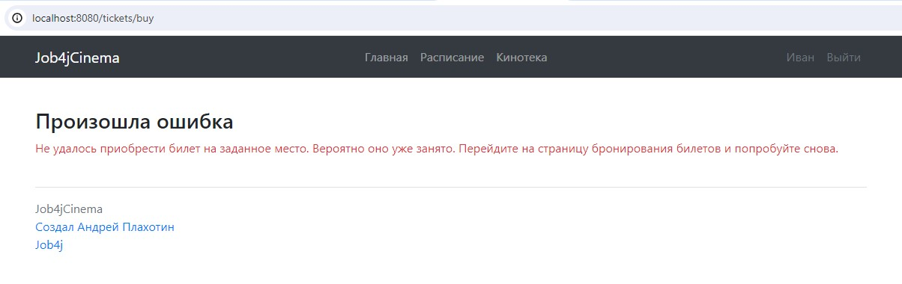
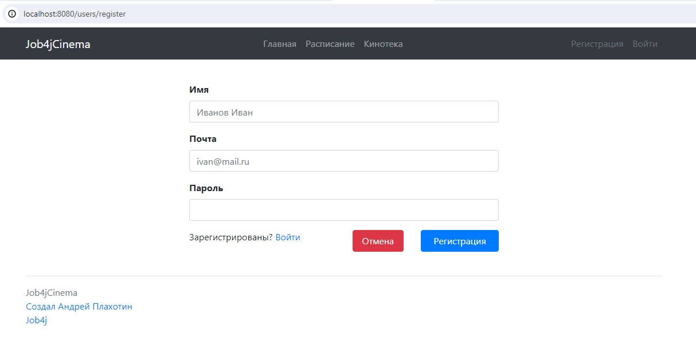
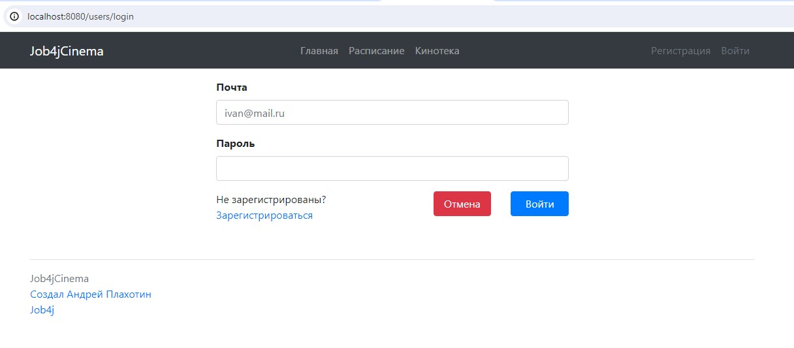

# Сервис - Кинотеатр.

## О проекте
Сайт по покупке билетов в кинотеатр. Содержит следующий функционал:

<ol>
    <li>Регистрацию/Вход;</li>
    <li>Вывод киносеансов и фильмов;</li>
    <li>Покупку билетов. </li>
</ol>

Разделение прав:

<ol>
    <li>Все пользователи имеют право просматривать информацию на сайте;</li>
    <li>Только зарегистрированные пользователю могут покупать билеты. Если пользователь не зарегистрирован и нажимает на кнопку "Купить билет", то его перебрасывает на страницу входа.</li>
</ol>

***

## Технологии
Spring (в частности Spring MVC и Spring Boot), Thymeleaf, Bootstrap, Liquibase, Sql2o, PostgreSQL

***

## Требования к окружению

Java 17, Maven 3.8, PostgreSQL 14, браузер.

***

## Запуск проекта

1. Создать базу данных cinema при помощи консоли PostgreSQL или терминала pgAdmin: <br>
```create database cinema```
2. Клонировать проект: <br>
```git clone git@github.com:plahotinandrei/job4j_cinema.git```
3. Перейти в корень проекта и при помощи Maven собрать проект: <br>
```mvn install```
4. После успешной сборки проекта перейти в каталог target и запустить приложение: <br>
```cd target``` <br>
```java -jar job4j_cinema-1.0-SNAPSHOT.jar```
5. В браузере открыть ссылку http://localhost:8080
***

## Взаимодействие с приложением
1. Главная страница. Общая информация о ресурсе и ссылки на основное меню.



2. Кинотека. Выводите список фильмов.



3. Расписание. Сеансы и связанные с ними фильмы. При выборе конкретного сеанса пользователь переходит на страницу покупки билета.



4. Страница покупки билета. Информация о сеансе и фильм. Также 2 выпадающих списка - один для указания ряда, другой для указания места, и кнопки "Купить", "Отмена". При нажатии на кнопку "Отмена" происходит переход на страницу с расписанием. При нажатии на кнопку "Купить" происходит переход на страницу статуса покупки(успешно/не успешно). Если пользователь не авторизован при нажатии на кнопку купить происходит редирект на страницу регистрации.



5. Страница с результатом успешной покупки билета.



6. Страница с результатом неудачной покупки билета.



7. Страница регистрации.



8. Страница входа.



**********************

### Контакты

> email: [plahotin94@yandex.ru](mailto:plahotin94@yandex.ru) <br>
> tg: [AndreyPlakhotin](https://t.me/AndreyPlakhotin) <br>
